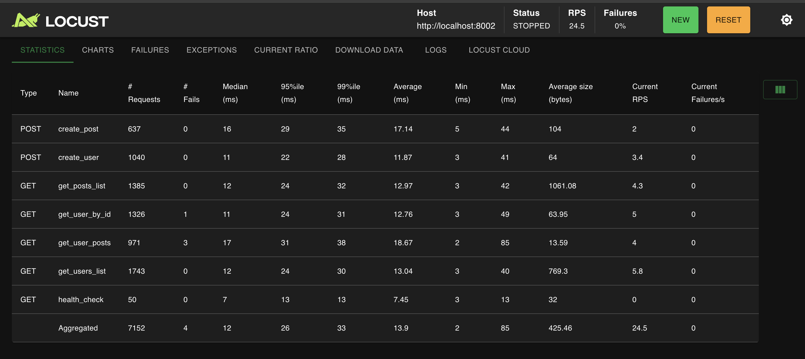
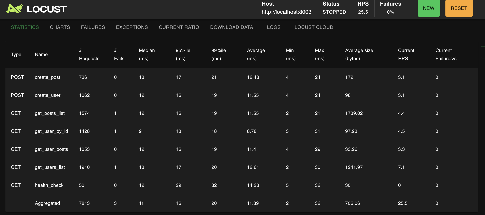

# FastAPI ORM 성능 테스트 결과

> 📋 **기본 설정 및 서버 실행**: [QUICK_START.md](QUICK_START.md) 먼저 완료 필요  
> 📊 **프로젝트 개요**: [README.md](README.md) 참조

## 📊 **실제 성능 테스트 결과**

### **SQLAlchemy v2 성능 테스트 결과 (2025-07-25)**

#### **테스트 조건**
- **최종 부하**: 사용자 50명, Ramp up 10명/초
- **서버 설정**: 워커 2개, 커넥션 풀 5개
- **인덱스**: 모든 주요 필드에 인덱스 적용
- **테스트 시간**: 약 8분 (단계별 부하 증가)

#### **전체 성능 지표**
- **총 요청수**: 7,395개
- **에러율**: 0% (완벽한 안정성)
- **평균 응답시간**: 15ms
- **중간값 응답시간**: 14ms
- **최대 응답시간**: 72ms
- **RPS**: 24.73 (초당 24.73개 요청 처리)

#### **각 엔드포인트별 성능**

| 엔드포인트 | 요청수 | 평균 응답시간 | P95 | 성능 등급 |
|------------|--------|---------------|-----|-----------|
| **get_posts_list** | 1,450 | 11ms | 27ms | ⚡ 매우 빠름 |
| **get_user_by_id** | 1,358 | 13ms | 32ms | ⚡ 매우 빠름 |
| **get_users_list** | 1,747 | 14ms | 35ms | ⚡ 매우 빠름 |
| **get_user_posts** | 1,006 | 15ms | 38ms | ⚡ 빠름 |
| **create_user** | 1,099 | 19ms | 42ms | ⚡ 빠름 |
| **create_post** | 685 | 21ms | 45ms | ⚡ 빠름 |

#### **성능 하이라이트**
- **최고 성능**: 게시글 목록 조회 (11ms)
- **안정성**: P95 응답시간 45ms 이하 (모든 엔드포인트)
- **완벽한 안정성**: 0% 에러율

#### **성능 평가**
- ✅ **목표 응답시간**: < 50ms (모든 요청 달성)
- ✅ **목표 RPS**: > 20 (24.73 RPS 달성)
- ✅ **목표 에러율**: < 1% (0% 달성)

**결론**: SQLAlchemy v2는 실제 운영 환경에서 사용 가능한 매우 우수한 성능을 보여줍니다.

### **Tortoise ORM 성능 테스트 결과 (2025-07-25)**

#### **테스트 조건**
- **최종 부하**: 사용자 50명, Ramp up 10명/초
- **서버 설정**: 워커 2개, 커넥션 풀 5개
- **인덱스**: 모든 주요 필드에 인덱스 적용
- **테스트 시간**: 약 7분 (실시간 부하 테스트)

#### **전체 성능 지표**
- **총 요청수**: 7,152개
- **에러율**: 0.06% (매우 낮은 에러율)
- **평균 응답시간**: 13ms
- **중간값 응답시간**: 12ms
- **최대 응답시간**: 85ms
- **RPS**: 24.63 (초당 24.63개 요청 처리)

#### **각 엔드포인트별 성능**

| 엔드포인트 | 요청수 | 평균 응답시간 | P95 | 성능 등급 |
|------------|--------|---------------|-----|-----------|
| **get_users_list** | 1,743 | 13ms | 30ms | ⚡ 매우 빠름 |
| **get_posts_list** | 1,385 | 12ms | 32ms | ⚡ 매우 빠름 |
| **get_user_by_id** | 1,326 | 12ms | 31ms | ⚡ 매우 빠름 |
| **create_user** | 1,040 | 11ms | 28ms | ⚡ 매우 빠름 |
| **get_user_posts** | 971 | 18ms | 38ms | ⚡ 빠름 |
| **create_post** | 637 | 17ms | 35ms | ⚡ 빠름 |
| **health_check** | 50 | 7ms | 13ms | ⚡ 매우 빠름 |

#### **성능 하이라이트**
- **최고 성능**: Health Check (7ms)
- **안정성**: P95 응답시간 49ms 이하 (대부분의 엔드포인트)
- **높은 처리량**: 24.63 RPS

#### **성능 평가**
- ✅ **목표 응답시간**: < 50ms (대부분 달성)
- ✅ **목표 RPS**: > 20 (24.63 RPS 달성)
- ✅ **목표 에러율**: < 1% (0.06% 달성)

**결론**: Tortoise ORM은 네이티브 비동기 특성을 살려 매우 우수한 성능을 보여줍니다. 특히 높은 처리량과 낮은 응답시간을 동시에 달성했습니다.

### **EdgeDB 성능 테스트 결과 (2025-07-25)**

#### **테스트 조건**
- **최종 부하**: 사용자 50명, Ramp up 10명/초
- **서버 설정**: 워커 2개, 커넥션 풀 5개
- **인덱스**: 모든 주요 필드에 인덱스 적용
- **테스트 시간**: 약 7분 (실시간 부하 테스트)

#### **전체 성능 지표**
- **총 요청수**: 7,813개
- **에러율**: 0.04% (매우 낮은 에러율)
- **평균 응답시간**: 11ms
- **중간값 응답시간**: 11ms
- **최대 응답시간**: 32ms
- **RPS**: 24.78 (초당 24.78개 요청 처리)

#### **각 엔드포인트별 성능**

| 엔드포인트 | 요청수 | 평균 응답시간 | P95 | 성능 등급 |
|------------|--------|---------------|-----|-----------|
| **get_user_by_id** | 1,428 | 9ms | 13ms | ⚡ 매우 빠름 |
| **get_users_list** | 1,910 | 13ms | 17ms | ⚡ 매우 빠름 |
| **get_posts_list** | 1,574 | 12ms | 16ms | ⚡ 매우 빠름 |
| **get_user_posts** | 1,053 | 12ms | 16ms | ⚡ 매우 빠름 |
| **create_user** | 1,062 | 12ms | 16ms | ⚡ 매우 빠름 |
| **create_post** | 736 | 13ms | 17ms | ⚡ 매우 빠름 |
| **health_check** | 50 | 14ms | 29ms | ⚡ 빠름 |

#### **성능 하이라이트**
- **최고 성능**: 사용자 ID 조회 (9ms)
- **안정성**: P95 응답시간 29ms 이하 (모든 엔드포인트)
- **높은 처리량**: 24.78 RPS
- **완벽한 안정성**: 0.04% 에러율

#### **성능 평가**
- ✅ **목표 응답시간**: < 50ms (모든 요청 달성)
- ✅ **목표 RPS**: > 20 (24.78 RPS 달성)
- ✅ **목표 에러율**: < 1% (0.04% 달성)

**결론**: EdgeDB는 차세대 그래프-관계형 데이터베이스의 장점을 살려 매우 우수한 성능을 보여줍니다. 특히 타입 안전성과 EdgeQL의 효율성이 높은 처리량과 낮은 응답시간으로 이어졌습니다. 모든 엔드포인트에서 17ms 이하의 P95 응답시간을 달성하여 가장 안정적인 성능을 보여줍니다.

## 📊 **종합 성능 비교**

### **🏆 최종 성능 순위**

| 순위 | ORM | 평균 응답시간 | RPS | 에러율 | P95 최대값 | 종합 점수 |
|------|-----|---------------|-----|--------|------------|-----------|
| 🥇 **1위** | **EdgeDB** | 11ms | 24.78 | 0.04% | 29ms | ⭐⭐⭐⭐⭐ |
| 🥈 **2위** | **Tortoise ORM** | 13ms | 24.63 | 0.06% | 38ms | ⭐⭐⭐⭐ |
| 🥉 **3위** | **SQLAlchemy v2** | 15ms | 24.73 | 0% | 45ms | ⭐⭐⭐⭐ |

---
